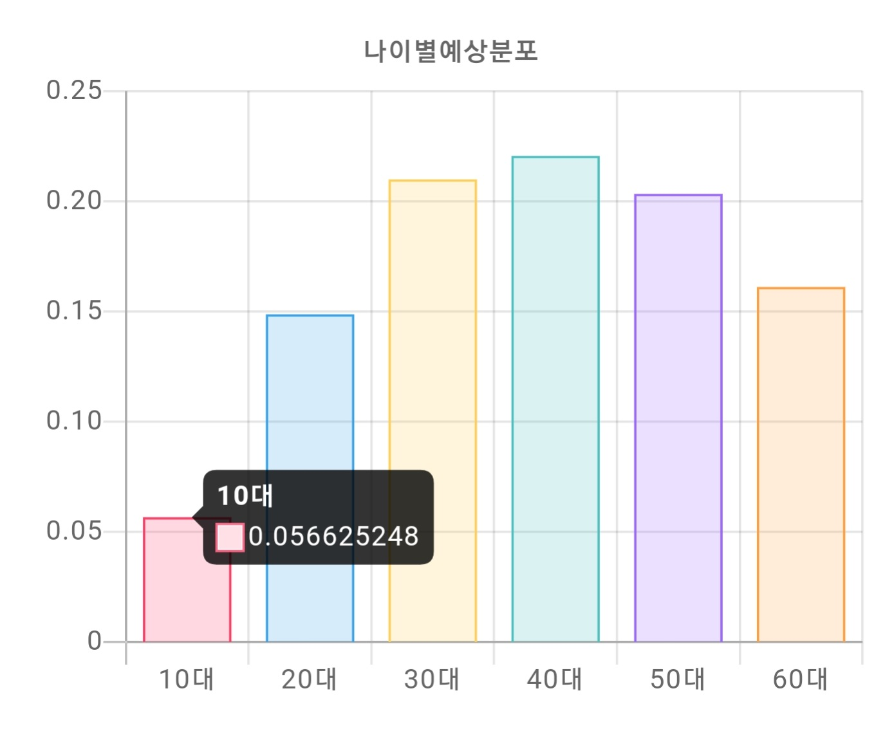
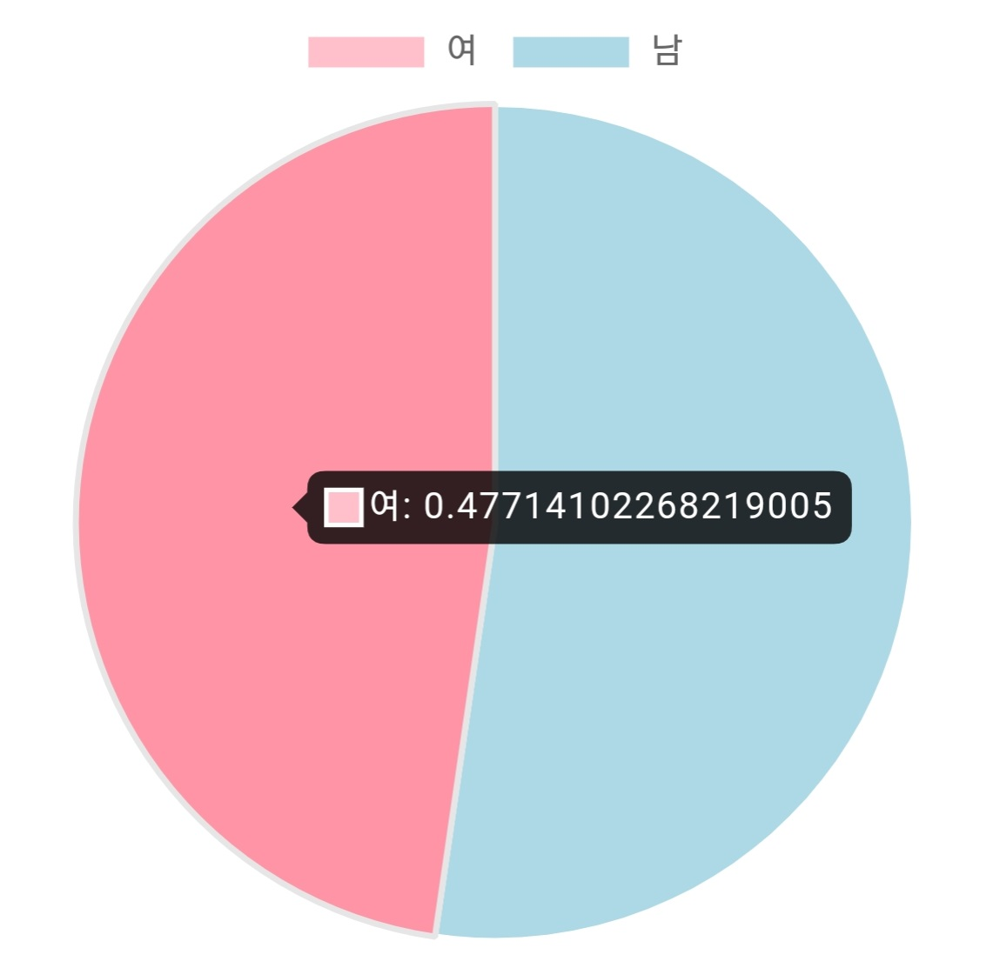
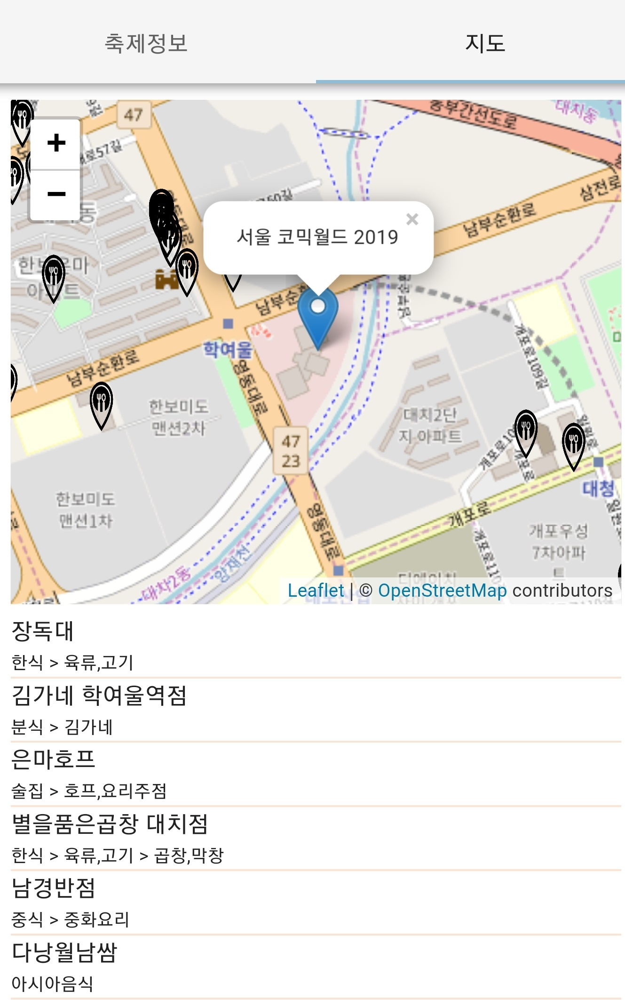
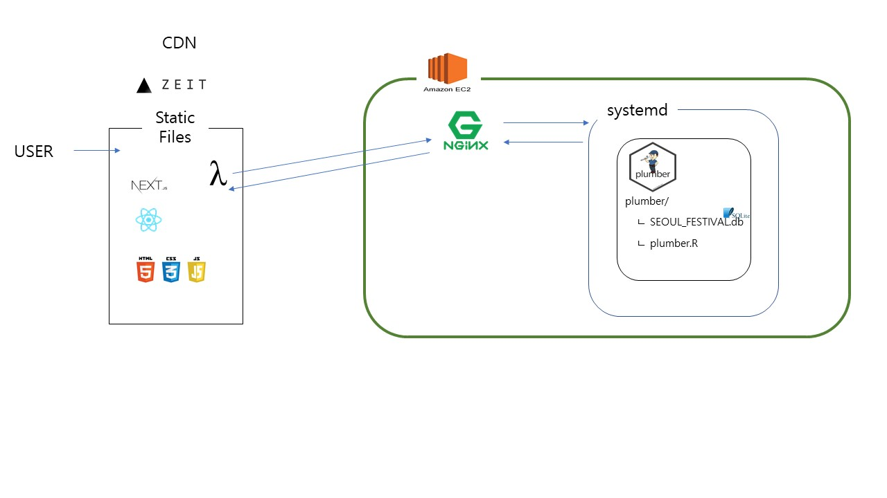

# [서울시 축제 대백과](https://seoul-festival.now.sh/)

# 1. 프로젝트 개요

## 1-1. 배경

### 기존의 축제 추천 앱 및 사이트의 한계점

1) 전국의 주요 축제만을 소개

2) 단순 정보 전달에 한정, 분석 정보 전달에 미흡 

## 1-2. 목적

### 기존의 서비스의 장점 계승 및 단점 보완을 통한 개선된 서비스 제공

#### 장점 계승

1) 지역 기반 주변 정보 전달 벤치마킹

2) 사용자 정보 기반 맞춤형 서비스 제공 벤치마킹

#### 단점 보완

3) 전국이 주요 축제가 아닌 서울의 모든 축제 정보 전달

4) 피상적인 정보 전달이 아닌 데이터 분석 기반 직관적 정보의 제공을 통한 보완

## 1-3. 서비스 소개

1) 연령별 이용자 비율 제공



2) 성별 이용자 비율 제공



3) 주변 지역 정보 제공



# 2. 데이터 분석

## 2-1. 사용 데이터

데이터 분석을 위해 사용한 데이터는 다음과 같다. 

### 1. 2015/2016/2019 서울시 축제 정보

- 문화체육관광부 제공 및 카카오 API 사용
- 축제명, 축제기간, 축제장소, 축제설명 등의 정보

[ 관련 파일 및 데이터 경로 ]

- [크롤링 및 전처리 파일](data/preprocess/crawling/crawling_final.ipynb)
- [2015/2016년 축제 정보](data/preprocess/crawling/api_crawling.xlsx)
- [2019년 축제 정보](data/preprocess/crawling/festival_crawling_2019.xlsx)

### 2. 유동인구(일별 유동인구, 거주지)

- 서울시 빅데이터 캠퍼스 제공. 직접 방문하여 데이터 추출.
- skt에서 수집한 2015년 8월 ~ 2016년 7월의 일단위 성별/연령별 유동인구 데이터
- EPSG:5179 좌표계 사용

[ 관련 파일 및 데이터 경로 ]

- [축제 장소 좌표계 수정](data/preprocess/float_pop/transform_coordinate.ipynb)
- [서울시 빅데이터 캠퍼스 데이터 추출 쿼리](data/preprocess/float_pop/)
- [유동인구 데이터](data/preprocess/float_pop/float_pop.xlsx)

### 3. 키워드

- 네이버,다음 뉴스 및 블로그 정보 (출처 - 네이버 및 다음)

문화체육관광부에서 제공하는 API와 홈페이지에서 제공하는 축제 정보를 토대로 카카오 API를 사용하여 해당 축제장소의 위경도 좌표 및 주변 맛집 정보를 얻었다. 
축제장소의 위경도를 원점으로 하여 반경 500m(상하좌우 500m)를 축제의 주영향권으로 보고 구역 내의 유동인구를 추출하였다. 
이 데이터는 추후 클러스터 예측 모델링에 사용하였다.
유동인구 데이터가 2015년 8월 ~ 2016년 7월만 존재하였으므로 해당 기간에 열린 축제만을 대상으로 하였으며, 그 기간이 일주일이 넘어가는 것은 제외하였다. 위의 전처리 결과 총 73개의 축제만을 분석하였다. 
(* 자세한 전처리 과정과 설명은 위의 파일들 참고)


문화체육관광부에서 제공하는 축제 설명만으로는 축제별 키워드 분석을 진행하기에 그 내용이 부족하였고, 추후 축제 키워드를 활용한 모델링을 할 때 축제 간의 구분 및 연결고리를 더욱 다양화 하기 위해 축제의 뉴스 정보를 크롤링하였다. 


## 2-2. 데이터베이스 구축

SQLite를 사용하여 데이터베이스를 구축하였다. 위에서 얻은 raw 데이터들을 전처리하고 얻은 필요한 정보만을 테이블로 추가하였다.

크게 분석용 테이블과 배포용 테이블로 나누어 데이터를 저장하였다. 분석용 테이블은 2015/2016년도의 축제정보와 유동인구 데이터로 이루어져있으며 배포용 테이블은 축제정보, 축제 주변 맛집 정보, 축제의 클러스터 예측정보로 이루어져있다. 배포용 테이블은 추가적인 축제정보 수집을 통해 계속해서 업데이트 될 예정이다. (자동화)

DB 구조는 다음과 같다.


[ 데이터 베이스 구축 파일 ]

- [DB 파일](cron/SEOUL_FESTIVAL.db)
- [DB 및 table 생성](data/database/)
- [DB 스키마](data/database/db_schema_res.Rmd)

## 2-3. 뉴스크롤링

### 개요
  우리가 가진 축제에 대한 정보는 일자나 위치 등 굉장히 한정적이었다. 축제의 성격이나 특징을 드러내주기에는 턱없이 부족하다고 판단했기 때문에 각 축제 별로 고유한 정보를 얻기 위해서 뉴스크롤링을 해주었다.  
  
 보통 축제의 경우에는 원래 유명한 축제라서 기사를 쓰기도 하지만 축제의 주최 기관에서 홍보 목적으로 기사를 쓰게 하기도 한다.  
 
 따라서 축제 기사에는 관계자들이 축제에 대해서 어필하고자 하는 내용들이 들어있기 마련이므로 축제에 좀 더 특화된 정보를 제공해 줄 수 있을 것이다.  

### 방식
 파이썬의 'request' 패키지를 사용해서 웹 크롤링을 해주었다.  
 
 네이버에 축제명을 검색했을 때 가장 먼저 나오는 10개의 기사들의 미리보기 내용들을 긁어와 주었다.  
 
 기사의 전문을 보려면 크롤링을 할 때 각 기사를 제공한 언론사의 사이트로 들어갔어야 했는데 이 때 언론사 마다 접근 헤더가 다르게 설정해주는 것이 기술적으로 어렵기 때문에 미리보기로 대체 해주었다. 또한 언론사마다 미리보기에 들어가는 내용들도 선별을 하므로 미리보기만으로 기사의 주요내용을 뽑아낼 수 있을거라 사료된다.  
 
 이 내용들은 문장들로 이루어져 있으므로 차후에 자연어 처리를 해주었다. 
 
[자연어처리 파일](github.com/HGmin1159/Seoul_Festival/keyword/untitled.ipynb)  


## 2-4. 키워드

### 개요
 위에서 얻은 축제 기사들에 대한 정보를 정리하고 문체부에서 얻은 축제설명을 정량적 데이터로 변경시켜주기 위해 자연어 처리를 해주었다. 이렇게 뽑아낸 핵심 명사들은 축제별 키워드로서 축제들을 구분짓는 정보로서 사용해줄 것이다.  
 
 축제별 키워드는 차후 유동인구 데이터가 있는 축제들을 분석하여 축제 이용자의 연령/성별 비율을 예측할 때 사용해 줄 것이다.  
 
[키워드 처리 파일](github.com/HGmin1159/Seoul_Festival/keyword/untitled.ipynb)
 
### 방법
 사용한 패키지는 python의 KONLPY이다. KONLP를 통해 수집한 문장들을 명사별로 끊어서 분석을 했다. 그런 다음 전체 축제에서 어떤 키워드가 주로 등장하는지 통계를 내어보았다. 그 결과는 다음과 같다.  
 
```{r}
tag_stat = read.csv("tag_stat1516.csv")
head(tag_stat)
```


 초반부에 ","나 " "가 대다수를 차지하였는 데 KONPLY에서는 이러한 것들을 자동으로 처리해주지 못한다. 따라서 상위100개 정도의 키워드에 대해서 눈으로 보면서 부적절하다고 판단되는 것은 제거하여 50개의 키워드를 추려냈다. 
 다음은 그 키워드에 대한 워드클라우드 시각화 자료이다. 
```{r}
sanwi = read.csv("sanwi1516.csv")
cor <- data.frame()

cor <- t(sanwi['빈도'])
colnames(cor) <- t(sanwi["keyword"])

wordcloud(colnames(cor),cor,)
```
 
 이렇게 만들어진 키워드를 이항변수화하여서 축제별로 키워드가 들어갔는지 안들어갔는지에 대해서 테이블을 만들어 주었다. 그 결과는 아래와 같다. 
```{r}
keyword = read.csv("base_tag.csv")
head(keyword[,1:6])
```
 이렇게 만들어진 키워드들은 다시 빈도별로 추려내어 사용자에게 전달할 것이다. 
 
 
## 2-5. 모델링

### 개요
 서울시 빅데이터 캠퍼스에서 가져온 유동인구 데이터와 텍스트마이닝을 통해 만들어준 축제별 키워드를 활용하여 앞으로 열리는  축제들의 사용자 비율을 예측 해주고자 한다. 연령비를 추정하는 모델, 성비를 추정하는 모델을 각각 만들어서 예측할 것이다.   
 
### 연령비 예측 모델  

### 개요 
 우리가 가지고 있는 X변수는 위에서 만들어준 축제별로 태그를 이항 변수화 해준 자료이다. 48개의 변수를 이항변수의 형태로 설명변수로 사용할 것이다.  
 
 반면 우리가 예측해줘야하는 y는 6개 연령대 별로 각각의 이용자 비율을 예측해줘야 한다. 무려 6개의 비율을 예측하는 소프트맥스형 모델을 만들어야 하는데, 샘플들이 부족하고 또 모든 변수가 이항변수인지라 연속형 자료를 예측하기에는 설명력 또한 떨어졌다.  
 
 따라서 정확한 비율을 예측하는 것은 어려울 것이라 생각해 사용자 비율을 클러스터 분석을 통해 나누어 주고 어느 클러스터에 속하는 지에 대한 멀티클래스 클래지파이 모델을 짜기로 했다. 
 
 이러한 방식을 취하는 이점은 두 가지로 우선 예측 대상을 단순화 하여 예측점수를 높일 수 있고, 또 이항변수로 이항변수를 예측 해주었기에 모델 구조에 있어서도 타당하다고 볼 수 있다. 그러나 예측 결과물이 축제별로 정확한 비율이 아니라 미리 결정해놓은 클러스터의 결과물을 사용하는 것이었기에 전달하는 정보가 적고 클러스터 분석이 얼마나 잘됐는지가 핵심이 될것이다. 

### 클러스터 분석

 클러스터 알고리즘은 분할 기법인 K-Means 방법을 사용하였다. 
```{r echo=FALSE, results="hide"}
fes_ratio = read.csv("fes_raio.csv")
library("tidyverse")
library("ggplot2")
library("shiny")

fes_ratio_age = fes_ratio[,2:7]+fes_ratio[,8:13]

colnames(fes_ratio_age) = c("Age_10","Age_20","Age_30","Age_40","Age_50","Age_60")
```


```{r warning=FALSE}
for (i in 1:8){
clt = kmeans(fes_ratio_age,i)
print(paste(i,"개 클러스터의 설명력 :",trunc(clt$betweenss/clt$totss*100),"%"))

nclt = as_tibble(clt$cluster) %>%
  group_by(value) %>%
  summarise(n())
print(paste("클러스터 할당 수 : ",nclt["n()"]))
}
```
 클러스터의 설명력은 클러스터 개수가 6개일때 78% 정도 나왔으므로 클러스터의 개수는 6개로 하는게 적합해 보인다.  
 
 그러나 클러스터가 5개일때 부터 오직 1개의 자료만 할당된 자료가 있는 데 이는 아웃라이어 때문이다. 그래도 이를 분석해보니 정보를 많이 담고 있는 아웃라이어라고 판단이 되었기에 그대로 살리는 방향으로 진행했다.  

 다음은 각 클러스터가 정말로 축제들을 대표할 만한지 클러스터 별 사용자 비율을 통계내어 보았다. 그 그림은 다음과 같다. 
```{r}
library(gridExtra)
set.seed("1")
clt = kmeans(fes_ratio_age,6)

vis = cbind(fes_ratio_age,clt$cluster)
vis_stat <- vis %>%
  group_by(clt$cluster) %>%
  summarise(Age_10=mean(Age_10),Age_20=mean(Age_20),Age_30=mean(Age_30),Age_40=mean(Age_40),Age_50=mean(Age_50),Age_60=mean(Age_60))

vis_gg = cbind(ind= c(1:6),data.frame(t(vis_stat))[2:7,])


p1 <- vis_gg %>%
  ggplot(aes(x=ind,y=X1))+
  geom_bar(stat="identity")+ xlab("연령대") + ylab("1번 클러스터")
p2 <- vis_gg %>%
  ggplot(aes(x=ind,y=X2))+
  geom_bar(stat="identity")+ xlab("연령대") +ylab("2번 클러스터")
p3 <- vis_gg %>%
  ggplot(aes(x=ind,y=X3))+
  geom_bar(stat="identity")+xlab("연령대") +ylab("3번 클러스터")
p4 <- vis_gg %>%
  ggplot(aes(x=ind,y=X4))+
  geom_bar(stat="identity")+xlab("연령대") +ylab("4번 클러스터")
p5 <- vis_gg %>%
  ggplot(aes(x=ind,y=X5))+
  geom_bar(stat="identity")+xlab("연령대") +ylab("5번 클러스터")
p6 <- vis_gg %>%
  ggplot(aes(x=ind,y=X6))+
  geom_bar(stat="identity")+xlab("연령대") +ylab("6번 클러스터")
grid.arrange(p1,p2,p3,p4,p5,p6)
```
 
 사용자 비율로 시각화를 해보니 클러스터 별로 연령 비율이 비교적 명확해 보인다. 1번 클러스터의 경우 고른 사용자 비율을 띄고 있고, 2번 클러스터는 중년들의 비율이 높다. 3번 클러스터는 20대가 대부분이며, 4번 클러스터는 10대가 대부분이다.  
 
 4번 클러스터의 경우 다른 데이터에 비해 괴리가 큰 데 이 클러스터에 전술한 아웃라이어가 속해있다. 
 클러스터의 결과물이 비교적 양호하였기에 클러스터 라벨을 짜주는 모델을 짜서 연령비를 예측하고자 한다. 
 
 [클러스터결과물](github.com/HGmin1159/Seoul_Festival/modeling/)

### 모델링
 모델링은 python의 sklearn 패키지를 사용해주었다. 모델링을 할 때 기반 모델들은 로지스틱 회귀분석, 랜덤포레스트, Ada Boost를 사용하였고, 멀티클래스 분류기인 만큼 One versus One과 One versus Rest 기법으로 모델을 합쳐주었다.

  
   이 모델들을 모두 사용한 다음 분류점수를 비교해보고자 한다. 그 결과는 다음과 같다.  


 모델점수는 Ada Boosting이 가장 높게 나왔다. 따라서 Ada부스트를 알고리즘으로 채택했다. 
 결과적으로 클러스터 분석을 통해 연령비를 대표하는 라벨을 만들어주었는데 이는 78%의 정보량 보존율을 가졌고, 예측 모델을 짜준결과 OVO Ada Boosting이 0.59로 가장 높게 나왔다.
 
### 성별 이용자 비율 예측 모델

### 개요

이번에는 Y의 6개의 연령별 비율을 성별을 기준으로 합해주었다.

여성 이용자 비율은 1-남성 비율로 도출해 낼 수 있기에 남성 이용자 비율을 예측하는 모델링을 짜보았다.

### 모델링

주어진 73개의 데이터 중 63개의 샘플을 train set으로 설정하고 10개의 샘플은 test set으로 설정해 주었다. 
그 후, Xgboost모델을 통해 남성 비율 예측 모델링을 진행하였고 
이를 통해, target data들에 대한 남성비율을 예측해 주었다.
물론, train set의 갯수가 매우 적어 예측의 정확도가 높다고 볼 수는 없지만 train set을 통해 검증해 본 결과,
rmse가 0.02내외로 실제 비율과 예측 비율의 평균적인 차이는 2%에 불과하여 유의미한 정보를 제공할 수 있다고 판단하여
이러한 분석 정보를 사용자에게 전달하고자 하였다.

[남성 이용자 비율 예측 파일]

- [남성 비율 ](https://github.com/HGmin1159/Seoul_Festival/tree/master/modeling/Man%20proportion%20predictiion)

# 3. 시스템 구조

정적페이지들을 CDN에 배포하고 추가로 필요한 기능을 외부에 요청하는 구조로 만들었다.

분류를 한다면 Serverless 아키텍쳐인 것 같다.



## 3-1. 정적 페이지(HTML, CSS, JavaScript)

[Next js](https://nextjs.org/) 프레임워크를 사용하였다. Next js는 React 라이브러리를 사용해 웹개발을 추상화시킨 프레임워크인데,  
그냥 자바스크립트만 사용하지 않은 이유는 가이드라인을 제공하는 도구가 필요했기 때문이다.  
물론 라이브러리의 유무보다 디자인패턴이 중요하지만, 그래도 경험이 적어 최대한 스파게티 코드를 만들지 않도록 강제하는 도구가 필요했다.  
또한 깃허브 통합이 편하게 되어있어 협업을 하는 데에도 용이하였다.  
그리고 배포시 성능 최적화가 잘 되어있어 마지막까지 선택하게 되었다.  
예를들어 프레임워크 없이 실험하였을때, 코드 스플리팅을 잘 못해 초기 로딩타임이 너무 길어졌는데, 
Next js가 코드 스플리팅을 자동으로 해줘서 웹에 접속 시 처음 기다리는 시간을 짧게 만들 수 있었다.  
디자인을 위해 추가로 패키지 material-ui, chart.js, leaflet을 사용하였다.  
(Netlify같은) [ZEIT NOW](https://zeit.co/)라는 CDN에 배포하였다.  

## 3-2. API(Plumber)

음식점 정보를 가져오기 위해 요청할 api 서버를 EC2 인스턴스(ubuntu 18.04 LTS)에 만들었다. R의 [Plumber](https://www.rplumber.io/)를 systemd를 사용하여 외부요청에 반응하도록 하였다.  
어떤 언어를 사용해도 이 경우에는 차이가 없었지만 추후에 ggplot등 관련된 R코드를 사용할 경우에 대비하여 plumber를 사용하였다.  
ZEIT NOW에 배포한 웹이 https를 사용해 클라이언트가 요청할 서버도 https를 사용할 필요가 있어,  
[letsencrypt](https://letsencrypt.org/)의 certbot을 사용해 SSL과 CA를 인증하고 Nginx를 사용하여 프록시를 통제하였다.  
사실 현재 서비스중인 음식점 api는 그냥 다른 외부 api를 사용하는 것과 다를 게 없지만,  
앱을 확장하면 직접 api endpoint를 구현해야 할 일이 생기니까 실제로 청사진을 만들어 볼 필요가 있었다.  

## 3-3. 데이터베이스

SQLite를 EC2에 올려서 사용하였다. 새로운 서버를 연결할 필요가 없고, 프로젝트 특성상 런타임에 DB에 데이터를 작성할 일이 없어서 충분할 것 같았다.  
하지만 나중에 확장성을 고려하면 MySQL이나 PostgreSQL을 사용하는 것이 좋을 것 같다.  

# 4. 향후 운영 방안

## 4-1. 자동화

- 매일 새롭게 업데이트 된 축제 정보를 크롤링하여 데이터베이스에 저장한다. (30일 간격, 문화체육관광부 홈페이지)
- 새롭게 추가된 축제 목록을 가지고 뉴스 크롤링을 하여 키워드 정보를 얻은 뒤 [클러스터 예측 모델](cron/festival_age_prediction.pkl)을 통해 클러스터를 예측한 후 이 또한 데이터베이스에 저장한다. 
- 새롭게 업데이트 된 정보가 사용자에게 뜰 수 있도록 서버를 업데이트한다.
- 위의 모든 작업을 `cron`을 활용해 자동화한다. 
- window의 경우 `nncron`을 설치한 후 cron.tab 파일에 cron 문법을 사용하여 실행할 파일 정보를 입력해놓는다. 

[ 자동화 관련 파일 ]
- [cron](cron/cron.tab)
- [크롤링 및 DB 업데이트 코드](cron/final_auto_crawling_db_update.py)
- [사용한 패키지들의 버전정보](cron/python_package_version.txt)

## 4-2. 아쉬운 점 및 향후 발전 방안

- 현재 유동인구 데이터의 제한(데이터 없음)으로 인해 최근의 유동인구를 활용한 모델링을 하지 못한 점이 아쉽다.  
- 사용자의 인적 정보, 축제 이용후기 등 추가적인 데이터 수집을 통해 보다 맞춤화된 축제 추천이 가능해질 것이다.  
- 사용자 인터페이스 구성에 있어서 축제별 유동인구 정보를 공간정보와 결합해 3D 시각화를 할 수 있다.  
- 현재 모바일에 최적화된 UI를 데스크탑에서도 최적화가 가능하다.  

 
